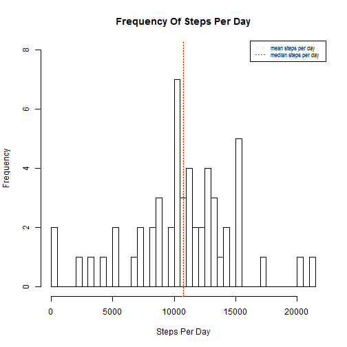
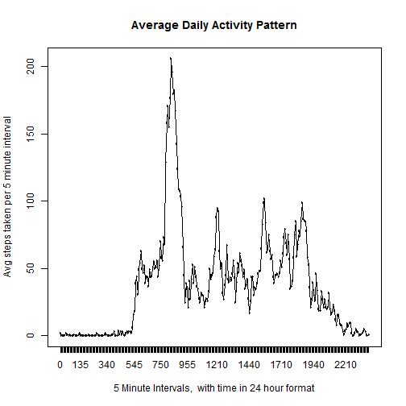
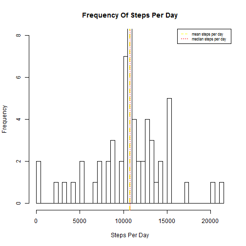
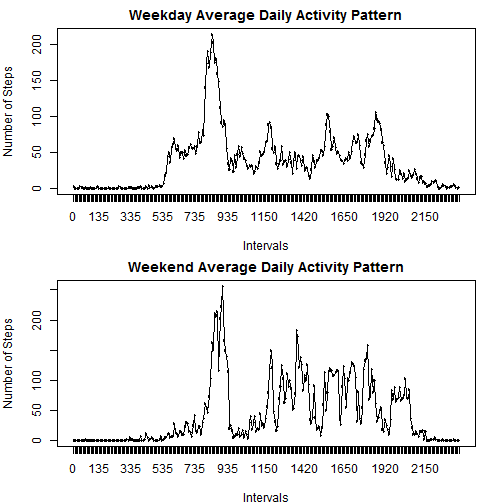

# Reproducible Research: Peer Assessment 1
========================================
**Marcia Lazo**  
###Create directory if not present
Set your working directory.
Then create a subdirectory called data


```r
if (!file.exists("data")) {
    dir.create("data")
}
```

### Download the file and extract to it to the data folder that was just created
Download the data file and **save it in your working directory**. 
The code below will unzip your zip file, place the contents into the data directory that was just created
and set your working directory to data.
The activity.zip file can be downloaded from [activity data set](https://github.com/rdpeng/RepData_PeerAssessment1/blob/master) 

```r
unzip(zipfile = "./activity.zip", exdir = "./data")
```


Read the data in and transform the columns as needed. This includes converting the date column to dates, adding a column called intervalFactor in which the intervals are converted to factors. Create a column called DayNames using the weekdays function on the dates. This column now contains the names of the day of the week for each date. The sixth column is added to store whether the day is a weekday or a weekend. This will be used later in this assignment to plot weekday activity against weekend activity


```r
setwd("./data")
activity <- read.csv("./activity.csv")
activity$Dates <- as.Date(as.character(activity$date))
activity$DayNames <- weekdays(activity$Dates)
activity[((activity$DayNames == "Saturday") | (activity$DayNames == "Sunday")), 
    6] <- "weekend"
activity[(!(activity$DayNames == "Saturday") | (activity$DayNames == "Sunday")), 
    6] <- "weekday"
## activity$intervalFactor <- factor(activity$interval)
```


### Create a histogram of the steps per day
The code below creates a histogram of the frequency of number of steps per day, and puts in a line for the median
and the mean number of steps per day as well

```r
# Calculate the steps per day
steps_per_day <- aggregate(steps ~ date, activity, sum)
hist(steps_per_day$steps, main = "Frequency Of Steps Per Day", breaks = nrow(steps_per_day), 
    ylim = c(0, 8), xlab = "Steps Per Day")
abline(v = mean(steps_per_day$steps), col = "yellow", lwd = 2, lty = "dashed")
abline(v = median(steps_per_day$steps), col = "red", lwd = 1, lty = "dotted")
legend("topright", lty = c(2, 3), col = c("yellow", "red", "blue"), legend = c("mean steps per day", 
    "median steps per day"), cex = 0.7)
```

 


### What is mean total number of steps taken per day?
calculate the mean and median number of steps per day and report them

```r
meanspd <- round(mean(steps_per_day$steps), 2)
medianspd <- round(median(steps_per_day$steps))
```


The mean number of steps per day is 10766
The median number of steps per day is 10765


## What is the average daily activity pattern?
The code below will create a new column from the interval data. The column class will be factor. This will be used for calculating the average for each five minute interval across all days
A plot is created showing the average steps per five minute intervals across all days

```r

activity$intervalFactor <- factor(activity$interval)
avg_per_interval <- aggregate(steps ~ intervalFactor, activity, mean, rm.na = T)

colnames(avg_per_interval) <- c("interval", "steps")
avg_per_interval$steps <- round(avg_per_interval$steps, 0)
plot(avg_per_interval, main = "Average Daily Activity Pattern", xlab = "5 Minute Intervals,  with time in 24 hour format", 
    ylab = "Avg steps taken per 5 minute interval")
lines(avg_per_interval$interval, avg_per_interval$steps, type = "l")
```

 

```r
most <- avg_per_interval$interval[which.max(avg_per_interval$steps)]
moststeps <- avg_per_interval[most, ]$steps
```

The 5 minute interval at 835 in the morning had the most steps per interval
It had 206 steps

## Imputing missing values
Calculate the number of missing values in the data set
I used values from the mean number of steps per interval to fill in the missing values for number of steps.
First I created a new dataset and calculates the number of 'NA's (which signify missing values).


```r
newData <- activity
nasList <- is.na(newData[1])
tot <- sum(nasList)
```

There were {r tot} missing steps values

Replace the 'NA' values with the mean value for that five-minute interval.

```r
tmp <- newData[nasList, ]
newData[nasList, 1] <- avg_per_interval[avg_per_interval$interval %in% tmp$interval, 
    2]
# The next line calculates the average number of steps per interval now that
# the NAs have been removed. I was interested in the results.
avg_per_interval2 <- aggregate(steps ~ intervalFactor, newData, mean, rm.na = T)

colnames(avg_per_interval2) <- c("interval", "steps")
avg_per_interval2$steps <- round(avg_per_interval2$steps, 0)
```


Now recreate the histogram of the total number of steps taken each day, with the missing values used in the calculation of the means replaced with the mean for that 5 minute interval

```r

steps_per_day2 <- aggregate(steps ~ date, newData, sum)
hist(steps_per_day2$steps, main = "Frequency Of Steps Per Day", breaks = nrow(steps_per_day), 
    ylim = c(0, 8), xlab = "Steps Per Day")
abline(v = mean(steps_per_day2$steps), col = "yellow", lwd = 2, lty = "dashed")
abline(v = median(steps_per_day2$steps), col = "red", lwd = 1, lty = "dotted")
legend("topright", lty = c(2, 3), col = c("yellow", "red", "blue"), legend = c("mean steps per day", 
    "median steps per day"), cex = 0.7)
```

 

```r

```


calculate the mean and median number of steps per day and report them

```r
steps_per_day2 <- aggregate(steps ~ date, newData, sum)
meanspd2 <- round(mean(steps_per_day2$steps), 2)
medianspd2 <- round(median(steps_per_day2$steps))
```

The mean number of steps per day is 10766
The median number of steps per day is 10762

There is a slight difference in the median number of steps per day. The difference found between the data set with missing values, and that with the missing values removed was minimal.


Are there differences in activity patterns between weekdays and weekends?
I caculated the weekdays and weekends in the first section of code at the start of this exercise.
Here I use that information to create a weekday and a weekend data fram. I use those new data frames to plot the activity for weekdays and weekends


```r
colnames(newData) <- c("steps", "date", "interval", "Dates", "DayNames", "wkEndOrWkDay", 
    "intervalFactor")
wkdayData <- subset(newData, wkEndOrWkDay == "weekday")
wkendData <- subset(newData, wkEndOrWkDay == "weekend")
avg_per_wkday_interval <- aggregate(steps ~ intervalFactor, wkdayData, mean, 
    rm.na = T)
avg_per_wkend_interval <- aggregate(steps ~ intervalFactor, wkendData, mean, 
    rm.na = T)

colnames(avg_per_wkday_interval) <- c("interval", "steps")
colnames(avg_per_wkend_interval) <- c("interval", "steps")
avg_per_wkday_interval$steps <- round(avg_per_wkday_interval$steps, 0)
avg_per_wkend_interval$steps <- round(avg_per_wkend_interval$steps, 0)
par(mfrow = c(2, 1), mar = c(4, 4, 2, 2))
mtext = (main = "TESTING")
plot(avg_per_wkday_interval, main = "Weekday Average Daily Activity Pattern", 
    xlab = "Intervals", ylab = "Number of Steps")
lines(avg_per_wkday_interval$interval, avg_per_wkday_interval$steps, type = "l")
most_wkDay <- avg_per_wkday_interval$interval[which.max(avg_per_wkday_interval$steps)]
moststeps_wkday <- avg_per_wkday_interval[most, ]$steps
plot(avg_per_wkend_interval, main = "Weekend Average Daily Activity Pattern", 
    xlab = "Intervals", ylab = "Number of Steps")

lines(avg_per_wkend_interval$interval, avg_per_wkend_interval$steps, type = "l")
```

 

```r
most_wkend <- avg_per_wkend_interval$interval[which.max(avg_per_wkend_interval$steps)]
moststeps_wkend <- avg_per_wkend_interval[most, ]$steps

```

The activity on the weekdays and the weekends is different. During the weekdays there are four marked peaks of activity. During the weekends the activity is more spread out through the day and appears to start later in the day.
