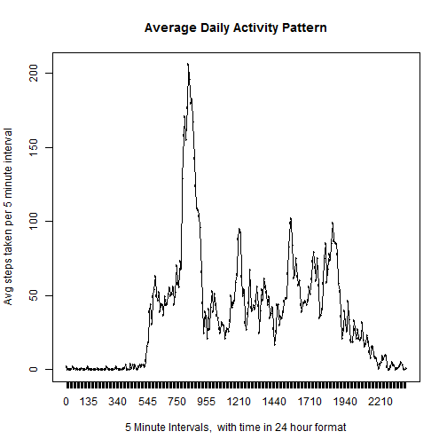

# Reproducible Research: Peer Assessment 1
========================================
#NOTE: To run this code you will need to install Hmisc. Make sure to do this before running the code or you will get an error message.

Set your working directory.
Then create a subdirectory called data
# Create directory if not present

```r
if (!file.exists("data")) {
    dir.create("data")
}
```

## Download the file and extract to it to the data folder that was just created
Download the data file and save it in your working directory. 
The code below will unzip your zip file, place the contents into the data directory that was just created
and set your working directory to data.
The activity.zip file can be downloaded from [activity data set](https://github.com/rdpeng/RepData_PeerAssessment1/blob/master) 

```r
unzip(zipfile = "./activity.zip", exdir = "./data")
```


### Read the data in and transform the columns as needed. This includes converting the date column to dates, adding a column called intervalFactor in which the intervals are converted to factors. Create a column called DayNames using the weekdays function on the dates. This column now contains the names of the day of the week for each date. The sixth column is added to store whether the day is a weekday or a weekend. 

```r
setwd("./data")
activity <- read.csv("./activity.csv")
activity$Dates <- as.Date(as.character(activity$date))
activity$DayNames <- weekdays(activity$Dates)
activity[((activity$DayNames == "Saturday") | (activity$DayNames == "Sunday")), 
    6] <- "weekend"
activity[(!(activity$DayNames == "Saturday") | (activity$DayNames == "Sunday")), 
    6] <- "weekday"
## activity$intervalFactor <- factor(activity$interval)
```


### Create a histogram of the steps per day
The code below creates a histogram of the frequency of number of steps per day, and puts in a line for the median
and the mean number of steps per day as well

```r
# Calculate the steps per day
steps_per_day <- aggregate(steps ~ date, activity, sum)
hist(steps_per_day$steps, main = "Frequency Of Steps Per Day", breaks = nrow(steps_per_day), 
    ylim = c(0, 8), xlab = "Steps Per Day")
abline(v = mean(steps_per_day$steps), col = "yellow", lwd = 2, lty = "dashed")
abline(v = median(steps_per_day$steps), col = "red", lwd = 1, lty = "dotted")
legend("topright", lty = c(2, 3), col = c("yellow", "red", "blue"), legend = c("mean steps per day", 
    "median steps per day"), cex = 0.7)
```

 


### What is mean total number of steps taken per day?
calculate the mean and median number of steps per day and report them

```r
meanspd <- round(mean(steps_per_day$steps), 2)
medianspd <- round(median(steps_per_day$steps))
```


The mean number of steps per day is 10766
The median number of steps per day is 10765


## What is the average daily activity pattern?
The code below will create a new column from the interval data. The column class will be factor. This will 
be used for calculating the average for each five minute interval across all days

```r

activity$intervalFactor <- factor(activity$interval)
avg_per_interval <- aggregate(steps ~ intervalFactor, activity, mean, rm.na = T)

colnames(avg_per_interval) <- c("interval", "steps")
avg_per_interval$steps <- round(avg_per_interval$steps, 0)
plot(avg_per_interval, main = "Average Daily Activity Pattern", xlab = "5 Minute Intervals", 
    ylab = "Avg steps taken per 5 minute interval")
lines(avg_per_interval$interval, avg_per_interval$steps, type = "l")
```

 

```r
most <- avg_per_interval$interval[which.max(avg_per_interval$steps)]
moststeps <- avg_per_interval[most, ]$steps
```

The interval during the time 835 had the most steps per interval
It had 206 steps
## Imputing missing values
Calculate the number of missing values in the data set
I randomly filled in the missing values using values from the mean number of steps per interval

```r
orig <- avg_per_interval$steps
orig <- impute(orig, "random")
```

```
## Error: could not find function "impute"
```

There are 

```

Error in format(numMissing, scientific = F) : 
  object 'numMissing' not found

```

 rows with NA's in the data

## Are there differences in activity patterns between weekdays and weekends?

Yes
Calculate weekday and weekend data

